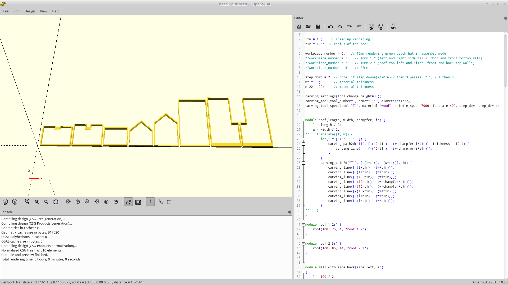
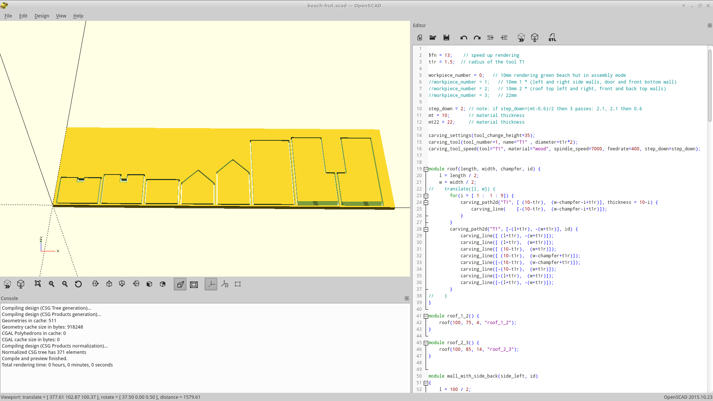
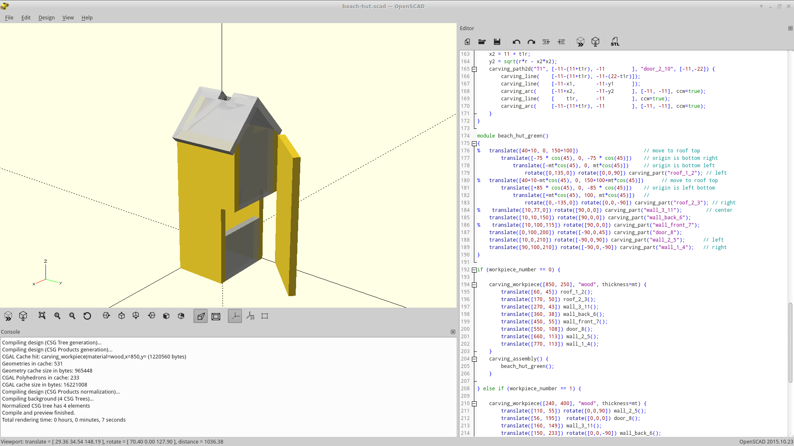
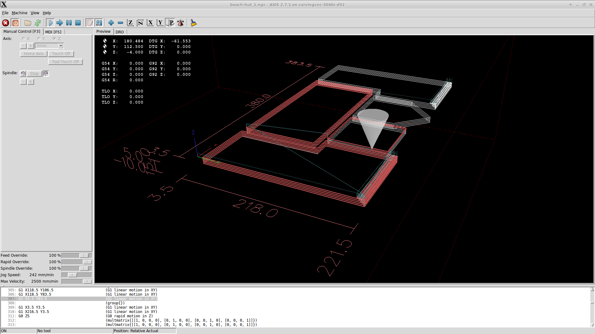
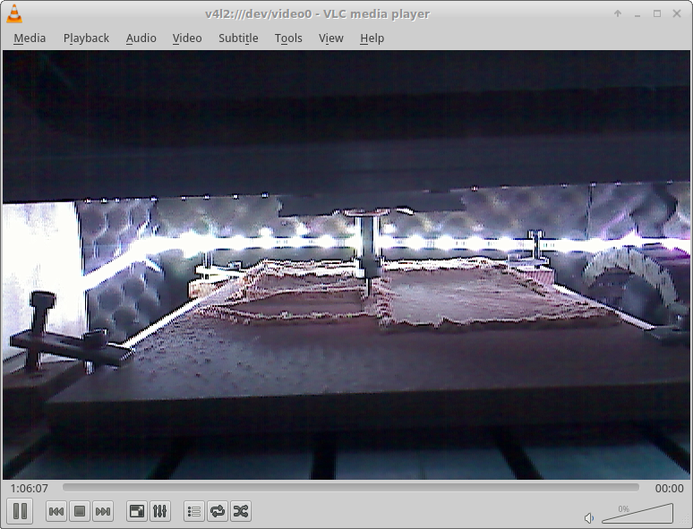

# Coupe de frane de robotique 2016 

The BeachBots http://www.planete-sciences.org/robot/index.php?section=pages&pageid=133 :
* Réglement Français: http://www.planete-sciences.org/robot/data/file/coupe/2016/C2016_Rules_FR.pdf
* Rules in English: http://www.planete-sciences.org/robot/data/file/coupe/2016/E2016_Rules_EN.pdf
* Forum The Beach Bots : Questions about 2016 rules - Questions sur le règlement 2016 : http://www.planete-sciences.org/forums/viewforum.php?f=88&sid=fb9d75d18de31bc7fd0b77b37ccce2b1

# OpenSCAD files

The following OpenSCAD files Requires the following OpenSCAD extension: https://github.com/peberhard/openscad/tree/carving-plugin

## Beach Hut / Cabane de plage

Generated from beach-hut.scad:

# Playing area image

Generated from SVG provided by Roboterclub Aachen e. V: https://raw.githubusercontent.com/roboterclubaachen/eurobot-resources/master/2016/playground.svg

