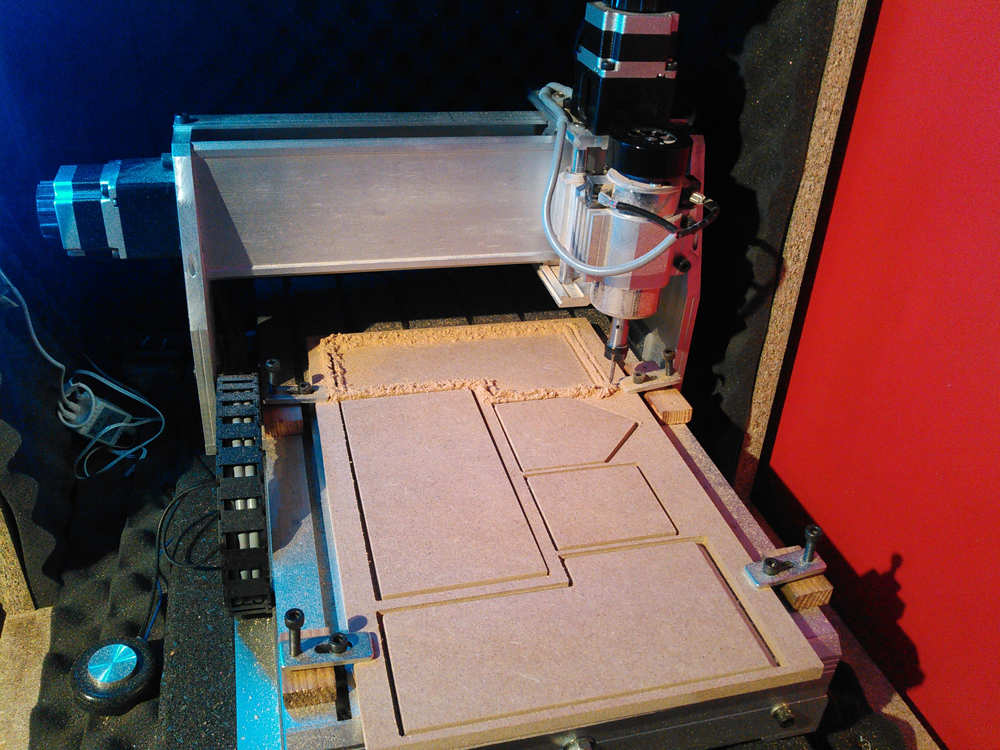
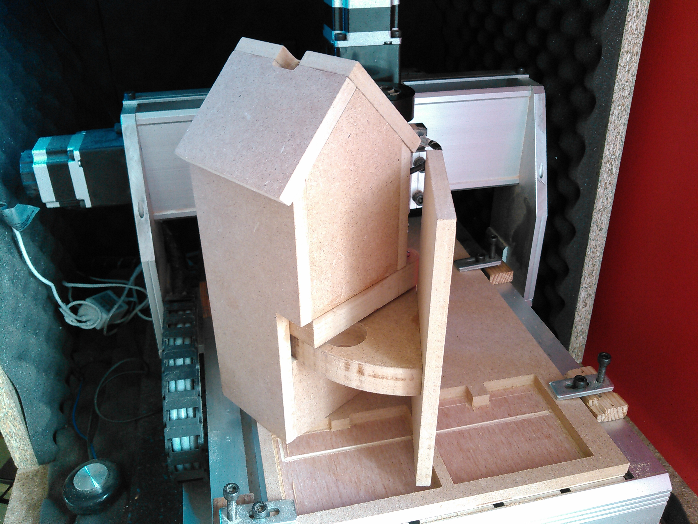

# Playing area - Terrain de jeu

## OpenSCAD files

The following OpenSCAD files Requires the following OpenSCAD extension: https://github.com/peberhard/openscad-carving-plugin-doc-examples

### Beach Hut / Cabane de plage

Generated from beach-hut.scad:

## Playing area image

Generated from SVG provided by Roboterclub Aachen e. V: https://raw.githubusercontent.com/roboterclubaachen/eurobot-resources/master/2016/playground.svg

